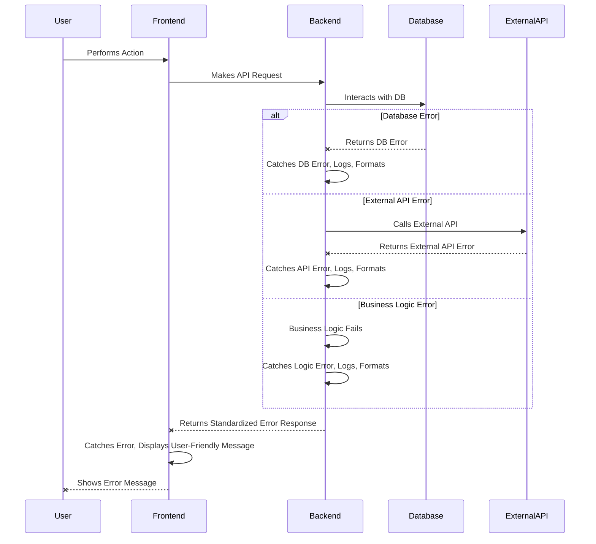

# **18. Error Handling Strategy**

This section outlines a unified approach to error handling, ensuring that errors are caught, processed, and presented consistently across the entire application.

### **Error Flow**



### **Error Response Format**

All API error responses from the backend will adhere to a standardized JSON format, making it predictable for the frontend to consume.

```typescript
interface ApiError {
  error: {
    code: string; // A unique, internal error code (e.g., "AUTH_001", "VALIDATION_002")
    message: string; // A user-friendly message (e.g., "Invalid credentials", "Channel limit reached")
    details?: Record<string, any>; // Optional: Additional details for debugging or specific error context (e.g., validation errors)
    timestamp: string; // ISO 8601 timestamp of when the error occurred
    requestId?: string; // Optional: A unique ID to trace the request in logs
  };
}
```

### **Frontend Error Handling**

The frontend will focus on gracefully catching errors from the backend and displaying user-friendly messages.

```typescript
// apps/web/src/lib/trpc.ts (example with error handling)
import { createTRPCProxyClient, httpBatchLink } from '@trpc/client';
import { TRPCClientError } from '@trpc/client';
import type { AppRouter } from '@/server/api/root';

export const api = createTRPCProxyClient<AppRouter>({
  links: [
    httpBatchLink({
      url: '/api/trpc',
      // Custom error handler for tRPC client
      fetch: async (url, options) => {
        try {
          const response = await fetch(url, options);
          if (!response.ok) {
            // Attempt to parse standard error format
            const errorData = await response.json();
            throw new TRPCClientError(errorData.error?.message || 'An unknown error occurred', {
              meta: errorData.error,
              // ... other error details
            });
          }
          return response;
        } catch (error) {
          console.error('Frontend fetch error:', error);
          // Display a generic error message or specific based on error type
          throw error; // Re-throw to be caught by React Query or component error boundaries
        }
      },
    }),
  ],
});

// apps/web/src/components/ErrorDisplay.tsx (conceptual)
// const ErrorDisplay: React.FC<{ error: ApiError }> = ({ error }) => {
//   if (!error) return null;
//   return (
//     <div className="text-red-500 p-2 border border-red-500 rounded">
//       <p>Error: {error.error.message}</p>
//       {error.error.details && <pre>{JSON.stringify(error.error.details, null, 2)}</pre>}
//     </div>
//   );
// };
```

### **Backend Error Handling**

The backend will implement centralized error handling to catch exceptions, log them, and format responses according to our `ApiError` interface.

```typescript
// packages/api/src/trpc.ts (simplified example for tRPC error handling)
import { initTRPC, TRPCError } from "@trpc/server";
import { ZodError } from "zod";

const t = initTRPC.create();

export const router = t.router;
export const publicProcedure = t.procedure;

// Centralized error formatter
export const appRouter = t.router({
  // ... your routers
}).formatError(({ shape, error }) => {
  return {
    ...shape,
    error: {
      code: shape.code,
      message: error.message,
      details: error.cause instanceof ZodError ? error.cause.flatten() : undefined,
      timestamp: new Date().toISOString(),
      // In production, avoid sending sensitive details
    },
  };
});

// Example of throwing a custom error in a procedure
// throw new TRPCError({
//   code: "BAD_REQUEST",
//   message: "Channel limit exceeded",
//   cause: { limit: 10, selected: 11 }
// });
```

---
