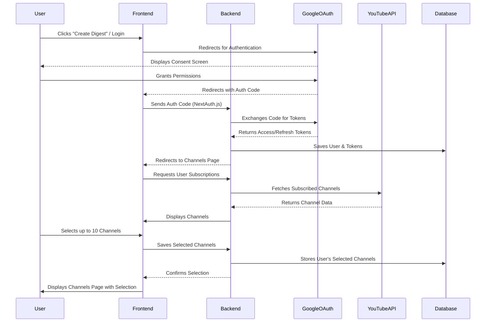
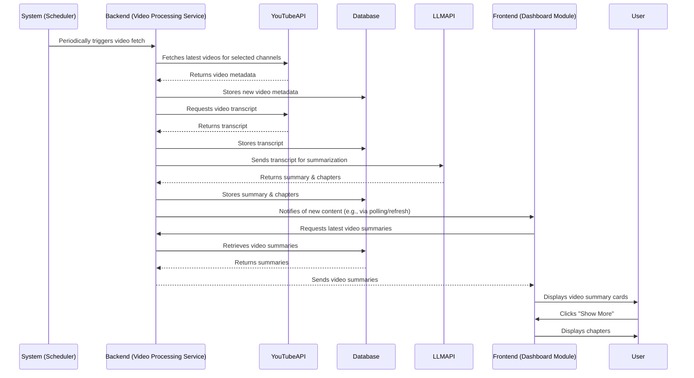
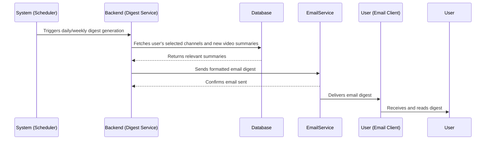
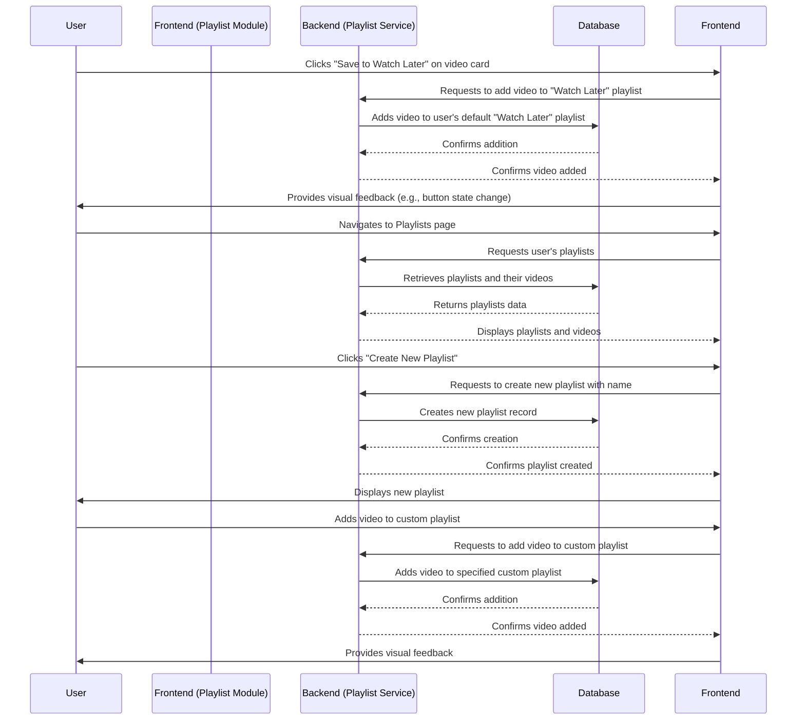

# **8. Core Workflows**

### **User Onboarding & Channel Selection**

---

### **Video Summarization & Dashboard Display**

This workflow describes how new videos are processed, summarized, and then displayed on the user's dashboard.

---

### **Email Digest Delivery**

This workflow describes how the scheduled email digests are generated and sent to the user.

---

### **Playlist Management**

This workflow describes how users save videos to playlists and manage their custom playlists.

---
